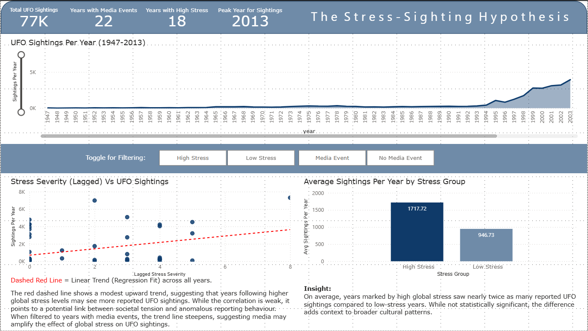
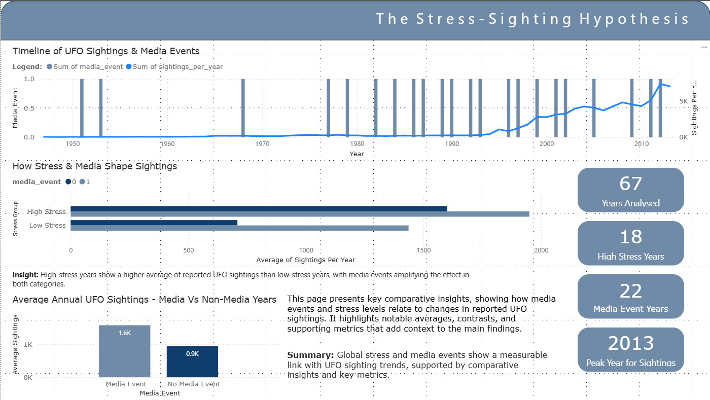

# 

>## Table of Contents
- [Executive Summary](#executive-summary)
- [Dataset Content](#dataset-content)
- [Business Requirements](#business-requirements)
  - [Persona & User Story](#persona--user-story)
  - [Alex's Requirements](#alexs-requirements)
  - [Value Proposition](#value-proposition)
- [Hypotheses](#hypotheses)
  - [H1: There is a positive correlation between the number of global stress events in a given year and the number of UFO sightings.](#h1-there-is-a-positive-correlation-between-the-number-of-global-stress-events-in-a-given-year-and-the-number-of-ufo-sightings)
  - [H2: Years with higher total stress severity scores are associated with a greater number of UFO sightings.](#h2-years-with-higher-total-stress-severity-scores-are-associated-with-a-greater-number-of-ufo-sightings)
  - [H3: Cultural media events, (such as the release of UFO-themed films or television series) correspond with noticeable short-term spikes in reported sightings.](#h3-cultural-media-events-such-as-the-release-of-ufo-themed-films-or-television-series-correspond-with-noticeable-short-term-spikes-in-reported-sightings)
- [Key Insights](#key-insights)
- [Conclusion](#conclusion)
- [Project Plan](#project-plan)
  - [Data Cleaning and Feature Engineering Summary](#data-cleaning-and-feature-engineering-summary)
  - [Feature Engineering Summary](#feature-engineering-summary)
  - [Exploratory Data Analysis and Regression Summary](#exploratory-data-analysis-and-regression-summary)
  - [Hypothesis Testing Summary](#hypothesis-testing-summary)
- [Mapping Business Requirements to Visualisations](#mapping-business-requirements-to-visualisations)
- [Analysis Techniques Used](#analysis-techniques-used)
  - [Use of Generative AI in Project Development](#use-of-generative-ai-in-project-development)
- [Ethical considerations](#ethical-considerations)
- [Dashboard Design](#dashboard-design)
  - [Colour Palette for Dashboard](#colour-palette-for-dashboard)
- [Unfixed Bugs](#unfixed-bugs)
- [Limitations](#limitations)
- [Development Roadmap](#development-roadmap)
- [Deployment](#deployment)
- [Main Data Analysis Libraries](#main-data-analysis-libraries)
- [Credits](#credits)
  - [Media](#media)
- [Acknowledgements](#acknowledgements)
- [Closing Statement](#closing-statement)

---

># The Stress-Sighting Hypothesis
### A Data-Driven Analysis of Global Events and Reports of the Unknown.

**The Stress-Sighting Hypothesis** has the project goal of investigating whether there is a meaningful correlation between the frequency of reported UFO sightings and periods of heightened cultural, political or global stress, using historical event data and publicly reported sightings. 

>## Executive Summary
This project investigates whether there is a measurable relationship between reported UFO sightings and periods of heightened societal stress, using historical sighting data from NUFORC and a manually curated dataset of major global events.  

Data was cleaned, merged, and analysed using Python and visualised via a two-page Power BI dashboard. Three hypotheses explored correlations between stress events, media influence, and sighting trends using regression analysis, non-parametric testing, and exploratory visualisation.

The findings suggest a modest positive correlation between lagged stress severity and sightings, with media exposure (particularly the debut of *The X-Files*) appearing to have a stronger influence on trends. While results are not statistically conclusive, they point toward a complex, multi-factor relationship worthy of further study.

---

>## Dataset Content
* Our primary dataset is taken from the Kaggle dataset 'UFO Sightings' found here: https://www.kaggle.com/datasets/NUFORC/ufo-sightings/data

It is a cleaned public dataset derived from NUFORC (National UFO Reporting Centre) reports. It contains 80,332 records of reported UFO sightings worldwide, spanning over a century.

### Dataset Overview: 
- **Date Range:** January 1st, 1910 - September 9, 2013
- **Number of Records:** 80,332
- **Primary Columns:**
    - **datetime:** Date and time of the sighting
    - **city, state, country**: Geographic location
    - **shape:** Reported shape of the object (e.g., disk, light, triangle)
    - **duration (seconds), duration (hours/min):** Estimated duration
    - **comments:** Eyewitness description
    - **latitude, longitude:** Coordinates

This dataset will be aggregated by year to explore temporal trends in UFO reporting and merged with the global_stress_events dataset to investigate possible correlations. 

- Our secondary dataset is the **global_stress_events.csv**
This dataset aims to contextualise major geopolitical, environmental, economic, and cultural events that are likely to contribute to collective public stress or uncertainty.

Rather than relying on a single predefined dataset, this list was manually curated to ensure it aligned specifically with the project's thematic focus: the intersection of cultural perception, public anxiety, and the unknown. Events were selected based on their:
- Global or national scale of impact
- Media visibility and saturation
- Potential to influence public mood, fear, or psychological tension
- Relevance to war, political instability, health crises, economic collapse, or culturally significant media related to UFOs and extraterrestrial life.

### Dataset Overview:
- **Date Range:** 1947-2023
- **Number of Records:** 35
- **Primary Columns:**
    - **year:** The year the event occurred
    - **event:** Name or description of event
    - **category:** Type of event (e.g., War, Cultural, Environmental)
    - **region:** Geographical scope (e.g., Global, USA, Europe)
    - **severity_(1-5):** Subjective rating of perceived societal impact
    - **notes:** Brief explanation of the event's significance

This dataset was designed as a companion to the UFO sightings data, to support hypothesis testing via statistical analysis and regression modelling. 
Whilst not exhaustive, this dataset serves as a representative proxy for fluctuations in global psychological stress and its potential relationship with the frequency of UFO reports. Future iterations could expand this dataset or refine severity scoring using sentiment analysis or survey data.

Severity ratings were assigned subjectively, based on the perceived scale and psychological weight of each event, and are intended to offer an optional variable for weighted analysis. 

---

>## Business Requirements
In an era shaped by information saturation, political polarisation, and global crises, public perception is increasingly complex and emotionally charged. For journalists, researchers, and communicators, understanding how people respond to uncertainty is as important as the events themselves.

This project explores the potential relationship between **reported UFO sightings** and **global stress events**, not to investigate extra-terrestrial phenomena, but to examine whether these sightings reflect **underlying patterns of public anxiety, media influence, and cultural tension.**

The outcome is a data-driven dashboard designed to support those working at the intersection of **data**, **storytelling**, and **public insight**.

---

>### Persona & User Story:

**Alex Holloway** is an investigative journalist, known for in-depth features that combine cultural analysis with data storytelling. They work with both independent media outlets and major publishers, seeking to explore how society processes uncertainty — from political unrest to media myths.

>### Alex's Requirements:
- **Reveal Patterns**

Alex needs to identify correlations between historical periods of stress and spikes in UFO reporting - fast, clearly and without technical issues. 

- **Narrative Context**

They want to explore not just *when* things happened, but *why it matters.* Explanatory text and annotations support deeper storytelling.

- **Usable Insights**

Our charts and summaries must be easy to extract for use in articles or reports, including explanatory captions and legends.

- **Trustworthy Structure**

The data pipeline must be transparent, ethical and well-documented to ensure and maintain credibility in their journalistic work.

### Value Proposition:
Our Dashboard must empower users like Alex to:
- Translate complex data into cultural insight
- Frame journalistic stories with empirical evidence
- Uncover social signals hiding in unconventional data
- Offer the audience a grounded perspective on how fear, media, and uncertainty intersect. 

---

>## Hypotheses
This project explores whether there is a measurable relationship between periods of global stress and the volume of reported UFO sightings. The following hypotheses will be tested using aggregated time-series data and statistical methods, including linear regression.

>### **H1: There is a positive correlation between the number of global stress events in a given year and the number of UFO sightings.**

**Why Alex cares:** This would give Alex a measurable way to link public anxiety during turbulent times to increased reporting of unusual phenomena, strengthening cultural narratives with data.

**Validation Approach:**

To test this hypothesis, we:

- Created a lagged version of the *'severity_sum'* and *'stress_event_count'* columns to account for delayed public or psychological response to global stress events.
- Calculated the correlation between the lagged severity and annual UFO sighting counts.
- Built a linear regression model using *'severity_sum_lag1'* as the predictor for *'sightings_per_year'*.
- Visualised the relationship using a regression plot.

---

### **Results & Conclusion:**

|  Metric  |  Result  |
|----------|----------|
|  **Slope**  |  363.84  |
|  **Intercept**  |  713.26  |
|  **R-squared**  |  0.14  |
|  **Mean Squared Error (MSE)**  |  2912525.87  |

Our regression model suggests a modest positive linear relationship between lagged global stress severity (*'severity_sum_lag1'*) and UFO sighting counts. The slope of ~364 indicates that, on average, each additional unit of stress severity is associated with an increase of approximately 364 reported UFO sightings in the following year.

However, the model's R-squared value of 0.14 indicates that only about 14% of the variation in sightings can be explained by this variable alone. This is not unexpected, given the complexity of factors influencing public reporting behaviour, such as media, politics, internet culture, and other psychological or social variables not captured in the dataset.

While not a predictive model, this regression helps quantify the correlation we've already observed and reinforces the central hypothesis: that global stress may play a contributing, if not dominant, role in UFO sighting trends.

---

>### **H2: Years with higher total stress severity scores are associated with a greater number of UFO sightings.**

**Why Alex cares:** This would help Alex identify whether particularly intense years of societal stress correlate with spikes in sightings, offering potential lead angles for investigative features.

**Validation Approach:**

To test this hypothesis, we began by classifying each year in our dataset as either:

- **High Stress** (severity_sum >= 3)
- **Low Stress** (severity_sum < 3)

We then compared the distribution of *'sightings_per_year'* between these two groups.

---

This plot clearly shows that:

- The **median** number of sightings is higher in High Stress years
- The **spread** of sightings is wider under High Stress conditions
- There are **notable outliers** (such as 7308 sightings in one Low Stress year)

**Summary Statistics:**

| Stress Group  | Count | Mean   | Median | Std Dev | Min | Max  |
|---------------|--------|--------|--------|---------|-----|------|
| **High Stress**   | 18     | 1717.7 | 271.5  | 1967.5  | 27  | 5076 |
| **Low Stress**    | 49     | 946.7  | 214.0  | 1773.2  | 7   | 7308 |

Although the **mean** number of sightings was **higher** in high-stress years, we couldn’t rely solely on descriptive stats, especially given the spread and skew of the data.

---

### Normality Testing:

We used the **Shapiro–Wilk test** to assess the distribution of each group:

- **Low Stress Group p-value**: 0.0000
- **High Stress Group p-value**: 0.0005

Both groups showed significant deviation from normality (positive skewness and low kurtosis), ruling out the use of a t-test.

---

### Mann–Whitney U Test:

Given the non-normal distribution of our data, we applied the **Mann–Whitney U Test**:

- **U statistic**: 562.5  
- **p-value**: **0.087**

---

### Results & Conclusion:

The p-value was **greater than 0.05**, meaning the observed difference in UFO sightings **was not statistically significant** at the 95% confidence level. Therefore, we can not reject the null hypothesis. That said, the result **hovers close to the significance threshold**, suggesting a **potential trend**. With a larger dataset or additional contextual variables, this hypothesis might gain further support.

For now, however, we **cannot confidently confirm** a statistically significant difference in UFO sightings between high-stress and low-stress years.

---

>### **H3: Cultural media events, (such as the release of UFO-themed films or television series) correspond with noticeable short-term spikes in reported sightings.**

**Why Alex cares:** This would allow Alex to explore how popular culture shapes public perception of the unknown, giving their audience insight into the interplay between media and mass reporting behaviour.

**Validation Approach:**

- Flag key media release years in the dataset (e.g., The X-Files in 1993, Independence Day in 1996)
- Visually inspect anomalies in *sightings_per_year* via time-series plots
- Compare spike magnitudes to adjacent years to investigate temporal influence such as lagging. 

---

#### Visualisation Interpretation:
The visualisation suggests a notable shift beginning in 1993, coinciding with the debut of *The X-Files*. From that year onward, there is a clear and sustained rise in reported sightings, which may reflect changing cultural attitudes, increased public interest, or a broader shift in how anomalous experiences are interpreted and reported.

While several media events cluster around minor fluctuations in sightings, *The X-Files* appears to mark a more significant inflection point in the data.

#### *Important Caveat:
Although the timing aligns with our hypothesis, this analysis is exploratory in nature. The presence of a correlation between media events and increased sightings does not imply a causal relationship. In order to statistically validate this hypothesis, further modelling would be required, such as:

- Causal impact analysis  
- Interrupted time series (ITS)  
- Time series decomposition or change point detection  

These methods would help isolate the effect of media exposure from other variables and provide stronger support for or against the hypothesis.

---
>### Key Insights

- **Modest positive correlation** between lagged stress severity and UFO sighting counts, suggesting that global stress may contribute to increased sightings, but is not the sole factor (R-squared = 0.14).

- **Media influence appears stronger** in shaping sighting trends, particularly following the 1993 debut of 'The X-Files', and the 1996 release of 'Independence Day' which coincided with a sustained rise in reports.

- **High-stress years** tend to show higher median sightings compared to low-stress years, though the difference was not statistically significant at the 95% confidence level (p = 0.086).

- **Cultural and psychological factors likely interact:** neither stress nor media fully explains sighting fluctuations in isolation, pointing toward a multi-factor influence model.

- **Visual storytelling through the dashboard** enables filtering and comparison by stress levels and media presence, making complex relationships accessible to both technical and non-technical users.

These insights give Alex a foundation of credible, data-backed observations that can be adapted into compelling storylines, from investigative articles to public talks. 

>### Conclusion
There is some visual evidence to suggest a relationship between cultural media events and increased UFO sighting reports. However, further statistical testing is necessary to move beyond correlation and confidently evaluate causality.

---

>## Project Plan

Project planning managed by GitHub Project Kanban Board. Found [here](https://github.com/users/Richard-wv/projects/4)

### Data Cleaning and Feature Engineering Summary

The UFO dataset underwent comprehensive cleaning to ensure analytical reliability. Key steps included:

- **Standardising column names** to lowercase with consistent formatting.
- **Handling missing values:**
  - Filled missing *'country'*, *'state'*, and *'shape'* values with 'unknown'.
  - Removed 694 rows (~0.86%) where *'datetime'* was missing or malformed, resulting in invalid *'year'* values.
- **Cleaning problematic numeric columns:**
  - Converted *'duration (seconds)'* and *'latitude'* to numeric using 'pd.to_numeric()' with coercion.
  - Dropped 4 rows with invalid or non-numeric duration/latitude values.
- **Ensuring valid data ranges:**
  - Confirmed all latitude/longitude values were within Earth’s bounds.
  - Verified *'year'* column ranged between 1947 and 2013 to align with the global stress dataset.
- **Dropped duplicate rows:** 2 exact duplicate entries were removed.
- **Converted data types:**
  - *'datetime'* and *'date_posted'* columns converted to proper datetime format.
  - Categorical fields (*'country'*, *'state'*, *'shape'*) cast to 'category' type for efficient storage.
  - *'year'* column cast to 'int' after NaNs were removed.

### Feature Engineering Summary

Due to the absence of meaningful numerical data in our dataset, we had to create additional features in order to prepare for analysis and regression. 

The following features were created:

- ***'year'*** extracted from the 'datetime' column to serve as a temporal anchor for all analysis.
- ***'sightings_per_year'***: A new summary DataFrame was created by grouping the cleaned UFO dataset by *'year'*, counting the number of sightings annually.
- The global stress dataset was also cleaned:
  - Columns standardised and typed correctly.
  - Aggregated into a yearly summary with:
    - *'stress_event_count'* (number of stress events per year)
    - *'severity_sum'* (total of severity scores per year).
- Both datasets were filtered to a shared timeframe (1947–2013) and merged using a **left join**, preserving years with zero stress events for baseline comparison.
- Missing values in the merged dataset (due to non-stress years) were filled with '0' to maintain continuity in analysis.

### Exploratory Data Analysis and Regression Summary

Our exploratory phase began with a thorough statistical overview of the dataset, including distributions, outliers, and visual trends. Each key variable (UFO sightings, stress event count, and severity) was examined individually and in relation to one another using line plots, boxplots, and correlation matrices.

From there, we tested whether a simple correlation existed between global stress severity and the number of reported sightings per year. Initial results showed a weak-to-moderate positive correlation. However, by introducing a 1-year lag to the stress variables to account for potential delay in public psychological response, we saw a noticeable improvement in correlation strength.

This led to the construction of a linear regression model using *'severity_sum_lag1'* as a predictor for *'sightings_per_year'*. The model confirmed a modest positive relationship, with a slope of approximately 364, indicating that for each point of increase in stress severity, we might expect an additional 364 sightings the following year.

While the model's R-Squared score was relatively low (0.14), this is not unexpected given the exploratory nature of the dataset. The regression was not intended for forecasting, but rather to support the hypothesis that societal stress may play a contributing role in increased UFO sighting reports - a theory our analysis consistently reinforced.

### Hypothesis Testing Summary

Our hypothesis testing phase was focused, structured, and grounded in the exploratory findings from earlier stages of analysis. Three key hypotheses were proposed, each testing a different facet of the relationship between reported UFO sightings and global or cultural stressors.

**H1: Global stress events are positively correlated with an increase in reported UFO sightings.**  
Using linear regression and correlation analysis, we identified a weak but positive correlation between annual stress severity and sightings, particularly after applying a one-year lag to stress data. This supports the idea that psychological or sociocultural effects of stress may not be immediate, but delayed. While our R-squared score was modest (0.14), it still indicates some level of explanatory influence. 

**H2: Years with a higher number of stress events will show significantly more UFO sightings than low-stress years.**  
We tested this hypothesis using the Mann-Whitney U Test, following normality checks that showed non-Gaussian distributions in both groups. Results showed a **p-value of 0.086**, indicating that while there may be a trend toward higher sightings during high-stress years, it wasn't statistically significant at the 95% confidence level. That being said, the result still adds texture to our overall findings and raises interesting questions for further investigation.

**H3: Cultural media events (e.g. UFO-related films or series) correlate with short-term spikes in sighting reports.**  
By overlaying key media event years onto our time-series data, we observed a compelling increase in sightings following the 1993 premiere of *The X-Files*. While other events had less impact, this particular cultural inflection point aligns with a lasting change in sighting frequency. 

Though the evidence here is anecdotal and visual rather than statistical, it raises valid questions about the influence of media narratives on public perception and behaviour.

**Conclusion:**  
Our hypothesis testing phase didn't aim to prove anything definitively, but rather to explore and evaluate patterns in the data through thoughtful experimentation. The results reflect a complex, nuanced relationship between stress, culture, and the unknown; one that doesn't offer easy answers, but certainly sparks deeper inquiry.

>## Mapping Business Requirements to Visualisations

| Business Requirement | Dashboard Feature | Rationale |
|----------------------|-------------------|-----------|
| Identify correlations between stress events and UFO sightings | Line chart showing UFO sightings per year overlaid with stress events and media events | Shows potential alignment between reported sightings and sociocultural triggers |
| Understand *why* things matter, not just *when* they happened | Tooltips or info cards with annotations explaining key spikes or media/cultural events | Adds contextual richness to raw trends, allowing narrative interpretation |
| Extract usable insights for journalism | Exportable visuals with captions and consistent styling | Ensures clarity and portability for use in media |
| Ensure transparency and credibility | Clean layout with clear data sources and explanation of methods | Promotes trust and reproducibility of findings |

By aligning these features with Alex's workflow, our dashboard would not only meet analytical goals but also support rapid narrative development for data-driven storytelling. 

---

>## Analysis Techniques Used

- **Correlation Analysis:** Used to quantify the linear relationship between stress severity and UFO sightings. Limitation: Doesn't account for confounding variables.
- **Lag Feature Engineering:** Introduced to account for delayed public response. Simple yet effective for this exploratory context.
- **Linear Regression:** Used for H1 to measure explanatory strength of stress severity. Limitation: Low R-squared score reflects many unaccounted for variables.
- **Normality Testing (Shapiro–Wilk):** Ensured the appropriate statistical test was used (non-parametric).
- **Mann–Whitney U Test:** Chosen over t-test due to non-normal distribution for H1 & H2.
- **Exploratory Visualisation:** Used to validate H3 hypothesis. Limitation: Visual-only; no causal modelling.

**Alternative methods considered (but not implemented due to scope/time):**
- Causal impact analysis
- Time series decomposition
- Sentiment analysis of public/media discourse

### Use of Generative AI in Project Development

Throughout the project, generative AI tools (specifically ChatGPT) were used to support idea development, design thinking, and code optimisation. During the early planning stages, I used AI to help brainstorm a suitable and original concept for the capstone, one that would align with course requirements but still reflect my own interests. This collaborative process helped shape the central hypothesis and business case.

As the project progressed, I used AI to clarify areas I was less confident in, particularly around the more technical elements like regression modelling and interpreting correlation results. It also helped guide the structure of my Jupyter Notebooks and provided feedback on whether certain analytical approaches were appropriate.

In the code itself, I occasionally used AI to review logic, catch errors, and refactor blocks for readability and efficiency. Importantly, I made sure to understand what was being suggested and adapt it to fit my own thinking, rather than copying anything blindly.

Overall, AI tools acted as a supportive co-pilot; helping me stay on track, troubleshoot efficiently, and stay confident during parts of the project that felt outside my comfort zone.

>## Ethical considerations

Although this project doesn't involve personal or identifiable data, several ethical considerations were still taken into account during the design and analysis process:

- **Data Source Integrity**: Both datasets used in this project — global UFO sightings (from NUFORC via Kaggle) and the manually curated global stress events — are public and non-sensitive. Care was taken to respect any licensing or attribution where relevant.

- **Anonymity & Privacy**: The UFO dataset contains no personal information, names, or location data beyond city/country-level detail. There is no risk of re-identification.

- **Bias and Interpretation**: This project explores a potentially sensitive cultural phenomenon (UFO sightings) alongside stress events such as wars, disasters, and economic crises. Care was taken not to trivialise or sensationalise these topics. The tone of analysis remains objective, exploratory, and grounded in the data.

- **Causality vs Correlation**: The project avoids making strong causal claims and is transparent about the limitations of correlational methods. The goal is not to prove that stress causes UFO sightings, but to explore possible associations that may be shaped by broader psychological, societal, or media influences.

- **Generative AI Use**: While generative AI tools were used to support planning and code efficiency, all decisions, interpretations, and final outputs reflect the author's own judgement and understanding.

- Approximately 12% of the rows in our UFO dataset were missing a recorded country. While it is technically possible to infer country from latitude and longitude via reverse geocoding, this was not implemented at scale due to performance and ethical limitations around API usage.

Because this project is primarily concerned with **yearly patterns on a global scale**, the absence of country-level information does not significantly impact the core analysis or hypotheses being tested.

---

>## Dashboard Design

The dashboard was designed across **two pages**, each serving a distinct purpose in communicating the findings of *The Stress-Sighting Hypothesis* to both technical and non-technical audiences.  

**Page 1** focuses on the **core narrative**, showing the overall UFO sightings trend over time, the relationship between lagged global stress severity and sightings, and the differences in average sightings between high-stress and low-stress years. A set of slicer buttons allows users to filter by stress group and media event years, enabling interactive exploration of the data. This page was built to present the main story quickly and clearly, even for those unfamiliar with statistical methods.

**Page 2** expands on the analysis with **comparative insights**, including a combined timeline showing sightings alongside media event markers, a grouped bar chart comparing sightings averages by stress and media category, and a direct comparison of media vs non-media years. Key metric cards (e.g. total years analysed, high-stress years, media event years, and peak sighting year) give immediate context.  

From a design standpoint, the layout and colour palette were chosen for **clarity and accessibility**, including adjustments to ensure usability for colour-blind viewers (Actually tested by a non-technical user with Deuteranomaly.). Consistent colour theming was use throughout the dashboard for continuity, and to emphasise a clean and professional aesthetic. 

Each visualisation is paired with a concise insight or summary, ensuring complex data relationships are communicated in plain English. Typographical considerations were also made to ensure consistency across all visualisations and pages, and the typeface (Verdana) was selected for clarity, readability, and overall accessibility.  The use of consistent titles, legends, and annotations bridges the gap between technical interpretation and accessible storytelling.

For Alex, this means being able to quickly switch between exploring data interactively and extracting clear, ready-to-publish visuals that maintain narrative integrity.

### Colour Palette for Dashboard

|  Colour  |  Hash Code  |
|----------|-------------|
|  Black  |  #000000  |
|  White  |  #FFFFFF  |
|  Light Blue  |  #6f8ba8  |
|  Dark Blue  |  #0F3D6E  |
|  Red  |  #FD0000  |

---

>## Unfixed Bugs

- No technical bugs were identified in the final version of the project. However, during development, I recognised gaps in my knowledge regarding certain hypothesis testing techniques and their interpretation. To address this, I sought additional learning resources, generative AI explanation, and clarified my understanding through practical application within the project workflow.

- In terms of accessibility, I invited a friend with deuteranomaly (a form of red-green colour blindness) to review the dashboard colour theme. Their feedback informed adjustments to the palette, ensuring that all visuals remain clear and interpretable for colour-blind users.

---

>## Limitations
- The global stress events dataset was manually curated and contains only 35 records, which limits statistical power.
- Severity scores are subjective and based on qualitative judgement, not quantitative metrics.
- The UFO sightings dataset may contain cultural and reporting biases, as NUFORC reports are voluntary submissions.
- Geographic analysis was not performed due to limited availability of consistent location data across both datasets.
- Media influence was assessed qualitatively via visual inspection rather than formal causal modelling.

Future work could address these limitations by expanding datasets, applying automated sentiment analysis to historical media coverage, and incorporating geospatial analysis.

### Future Analysis Opportunities

While this project was exploratory in nature, there are several promising directions for deeper or more rigorous analysis that could build on the current work:

- **Expand the Global Stress Events Dataset:**  
  Increase the number of recorded events, incorporating regional events alongside global ones. This could improve statistical power and granularity.

- **Refine Severity Scoring:**  
  Replace the subjective 1–5 scale with a more objective measure, potentially derived from sentiment analysis of historical news coverage or public opinion data.

- **Causal Modelling:**  
  Apply methods such as *Interrupted Time Series* or *Causal Impact Analysis* to evaluate whether specific events (e.g., media releases or global crises) have a statistically measurable effect on sighting frequencies.

- **Geospatial Analysis:**  
  Incorporate geographic coordinates to explore whether certain regions exhibit stronger stress–sighting correlations, potentially revealing cultural or demographic influences.

- **Temporal Decomposition:**  
  Use time series decomposition or change point detection to separate long-term trends from short-term fluctuations, clarifying whether observed spikes are anomalies or part of broader cycles.

- **Media Influence Modelling:**  
  Quantify media exposure more precisely (e.g., number of news articles, television ratings) to better isolate the effect of cultural events from other factors.

These enhancements could lead to more nuanced insights and stronger statistical conclusions, helping to clarify the interplay between societal stress, media, and public reporting behaviour.

---

>## Development Roadmap

One of the main challenges I faced during this project was navigating and effectively using Power BI. While I successfully built the dashboard, there were moments where I struggled to locate certain features or adjust settings within its (notably cluttered) interface. This was addressed through a mix of trial-and-error, online documentation, and AI consultation, but it highlighted the need for more dedicated Power BI practice.

Another challenge was applying and interpreting hypothesis testing methods. While I understood the broad concepts, my statistical confidence and ability to interpret results could be stronger. I overcame some of this by working through additional resources and applying techniques directly within the project, but I plan to continue developing this skill set to strengthen future analysis work.

**Next Steps:**
- Dedicate time to deepening my Power BI skills, particularly around advanced visualisation techniques, DAX, and user interaction design.
- Expand my statistical knowledge, with a focus on hypothesis testing, regression modelling, and interpreting outputs confidently.
- Explore further accessibility best practices to ensure future dashboards are inclusive for all audiences.

---

>## Deployment

No online deployment was used in this project, and the Power BI Dashboard file has been added to our /dashboard project directory and repository for consideration and assessment. 

---

>## Main Data Analysis Libraries
- **Python** - primary coding language.
- **Pandas** - for data cleaning, transformation, merging datasets and feature engineering.
- **NumPy** - for numerical operations, handling arrays, and supporting calculations in Pandas workflow.
- **Seaborn** - for statistical data visualisation, such as regression plot and distribution charts.
- **MatPlotLib** - for creating static plots during exploratory analysis.
- **Plotly** - for interactive visualisations within Jupyter Notebook 2_data_analysis.ipynb
- **SciPy** - for statistical testing, including the Shapiro-Wilk and Mann-Whitney U tests.
- **Scikit-Learn** - for regression modelling and calculating evaluation metrics. 

---

>## Credits 

- Code Institute Learning Management System (LMS) for visualisation code suggestions.
- https://github.com/Code-Institute-Org/data-analytics-template/tree/main Data Analytics GitHub Project template provided by Code Institute.
- https://github.com/Code-Institute-Solutions/da-README-template README template provided by Code Institute.
- https://github.com/adam-p/markdown-here/wiki/markdown-cheatsheet for markdown guidance.
- https://en.wikipedia.org/wiki/Kurtosis for clarifying Kurtosis.
- https://www.investopedia.com/terms/p/platykurtic.asp for explaining Platykurtic kurtosis.
- https://seaborn.pydata.org/tutorial/color_palettes.html for visualisation colour palette selection.
- ChatGPT for creating User Story portrait, project title card image, Coding suggestions, project planning ideas, and 'sticking point' clarifications. 
- Copilot for some coding suggestions and code annotation auto-completes. 
- https://www.canva.com was used for creating the project title card and Persona Card. 
- https://shorturl.at/NfSzd NHS PTSD Symptoms timeframe information used for Lag Analysis research. (shorturl.at used to truncate hyperlink address)
- https://www.itl.nist.gov/div898/handbook/eda/section3/eda35b.htm For Skewness and Kurtosis clarification. 

### Media

- Images for user story and project header were created using ChatGPT to avoid potential ethical and licensing conflicts.

---

>## Acknowledgements
- Code Institute Staff for their continuous support throughout my learning journey.
- My Data Analytics learning cohort for moral support.
- Family and friends for moral support and understanding during my learning journey. 
- Apple Music for assistance in providing 'focus fuel' throughout the project.
- My cat, "Cersei" for reminding me to take regular coding breaks. 

---

>## Closing Statement
This capstone project has enhanced my technical and analytical skills, particularly in Power BI, hypothesis testing, and data storytelling. The project highlighted the importance of project working time estimations, as the data cleaning phase took considerably longer than I initially thought. It has also reinforced the importance of clear communication when presenting complex patterns to mixed audiences.  

While exploratory in nature, the project provides a foundation for further, more rigorous research into the intersection of societal stress, cultural influence, and reported anomalous phenomena.

---

